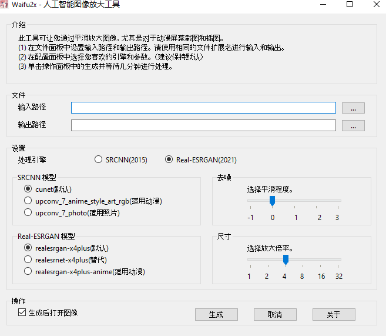
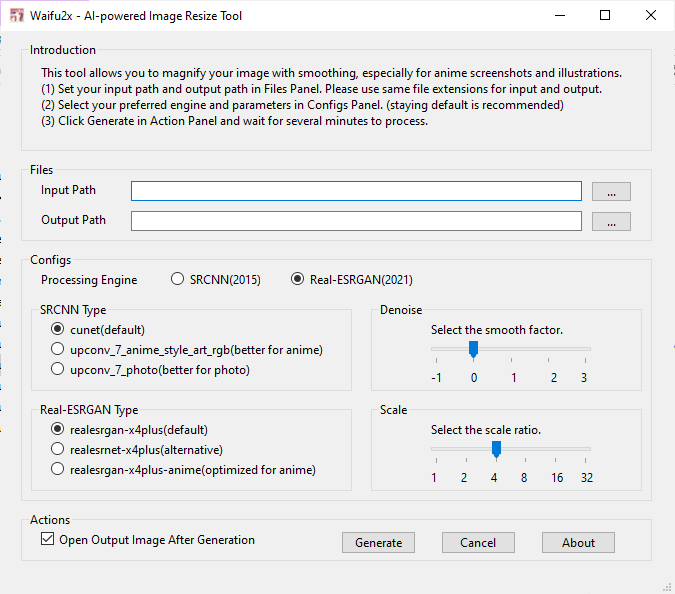

# waifu2x-qt

此工具可让您通过平滑放大图像，尤其是对于动漫屏幕截图和插图。/This tool allows you to magnify your image with smoothing, especially for anime screenshots and illustrations.

* 1.0.0 finish the basic function
* 1.1.0 all in one file
* 1.1.1 fix paths with spaces
* 1.2.0 support Chinese
* 1.2.1 remove log to avoid administrator right
* 1.2.2 fix real-esrgan with ratio which is not 4

## 配置要求/Requirements

* 操作系统/Operating System: Windows X64
* 显卡/Graphics Card: 支持Vulkan/Vulkan Support

## 注意事項/Notice

(1)请不要使用系统路径作为输出路径。/Please don't use the system path as the output path.

(2)请务必检查您的显卡是否支持 Vulkan。 从以下 URL 检查是否支持 GPU。/Be sure to check your graphics card with Vulkan support. Check if GPU is supported from the following URL.

Intel GPU: https://www.intel.com/content/www/us/en/support/articles/000005524/graphics.html
AMD GPU: https://www.amd.com/en/technologies/vulkan
NVIDIA GPU: https://developer.nvidia.com/vulkan-driver

(3)如果您遇到崩溃或错误，请尝试升级您的 GPU 驱动程序。/If you encounter crash or error, try to upgrade your GPU driver.

* Intel: https://downloadcenter.intel.com/product/80939/Graphics-Drivers
* AMD: https://www.amd.com/en/support
* NVIDIA: https://www.nvidia.com/Download/index.aspx


## 运行/Run



打开 Waifu2x_zh.exe 并按照说明进行操作。

(1) 在文件面板中设置输入路径和输出路径。 请使用相同的文件扩展名进行输入和输出。

(2) 在配置面板中选择您喜欢的引擎和参数。 （建议保持默认）

(3) 单击操作面板中的生成并等待几分钟进行处理。



Open Waifu2x_en.exe and follow the instructions.

(1) Set your input path and output path in Files Panel. Please use same file extensions for input and output.

(2) Select your preferred engine and parameters in Configs Panel. (staying default is recommended)

(3) Click Generate in Action Panel and wait for several minutes to process. 

## Develop

1. Clone the repository

2. Download waifu2x and real-esrgan package
```
wget https://github.com/nihui/waifu2x-ncnn-vulkan/releases/download/20210521/waifu2x-ncnn-vulkan-20210521-windows.zip
unzip waifu2x-ncnn-vulkan-20210521-windows.zip -d waifu2x
wget https://github.com/xinntao/Real-ESRGAN/releases/download/v0.2.3.0/realesrgan-ncnn-vulkan-20211212-windows.zip
unzip realesrgan-ncnn-vulkan-20211212-windows.zip -d realesrgan
```

3. Prepare python environment
```
pip install PySide6
```

## Build

1. Prepare python environment
```
pip install PyInstaller
```

2. Build package
```
pyinstaller --onefile --windowed --icon=logo.ico main.py  --add-data "realesrgan;realesrgan" --add-data "waifu2x;waifu2x" --add-data "logo.ico;." 
```

## Privacy

* We generate log for your convenient feedback. 
* We access images on your disk to process. 
* We do not collect any of your informations.

## Credit

* The SRCNN engine is from [waifu2x-ncnn-vulkan](https://github.com/nihui/waifu2x-ncnn-vulkan).
* The Real-ESRGAN engine is from [Real-ESRGAN-ncnn-vulkan](https://github.com/xinntao/Real-ESRGAN-ncnn-vulkan).
* The GUI is built with [Pyside6](https://doc.qt.io/qtforpython/).
