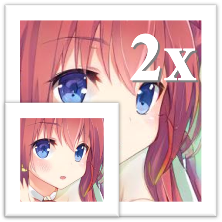

# waifu2x-qt

This tool allows you to magnify your image with smoothing, especially for anime screenshots and illustrations.

## Requirements

* Operating System: Windows
* Graphics Card: Vulkan Supported

If you encounter crash or error, try to upgrade your GPU driver

* Intel: https://downloadcenter.intel.com/product/80939/Graphics-Drivers
* AMD: https://www.amd.com/en/support
* NVIDIA: https://www.nvidia.com/Download/index.aspx

## Run

Download [Waifu2x.zip](https://github.com/ryanhe312/waifu2x-qt/releases/download/1.0.0/Waifu2x.zip) and unzip it. Open Waifu2x.exe and follow the instructions.

(1) Set your input path and output path in Files Panel. Please use same file extensions for input and output.

(2) Select your preferred engine and parameters in Configs Panel. (staying default is recommended)

(3) Click Generate in Action Panel and wait for several minutes to process. 

## Develop

1. Clone the repository

2. Download waifu2x and real-esrgan package
```
wget https://github.com/nihui/waifu2x-ncnn-vulkan/releases/download/20210521/waifu2x-ncnn-vulkan-20210521-windows.zip
unzip waifu2x-ncnn-vulkan-20210521-windows.zip
wget https://github.com/xinntao/Real-ESRGAN/releases/download/v0.2.3.0/realesrgan-ncnn-vulkan-20211212-windows.zip
unzip realesrgan-ncnn-vulkan-20211212-windows.zip
```

3. Prepare python environment
```
pip install PySide6
```

## Build

1. Prepare python environment
```
pip install PyInstaller
```

2. Build package
```
pyinstaller --onefile --windowed --icon=logo.ico main.py
```

## Privacy

* We generate log for your convenient feedback. 
* We access images on your disk to process. 
* We do not collect any of your informations.

## Credit

* The SRCNN engine is from [waifu2x-ncnn-vulkan](https://github.com/nihui/waifu2x-ncnn-vulkan).
* The Real-ESRGAN engine is from [Real-ESRGAN-ncnn-vulkan](https://github.com/xinntao/Real-ESRGAN-ncnn-vulkan).
* The GUI is built with [Pyside6](https://doc.qt.io/qtforpython/).
